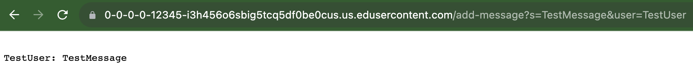
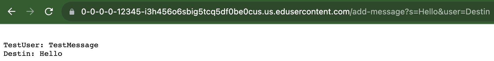
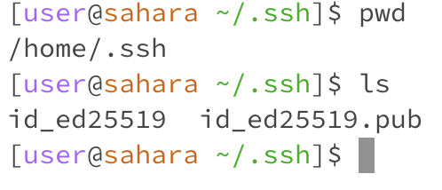
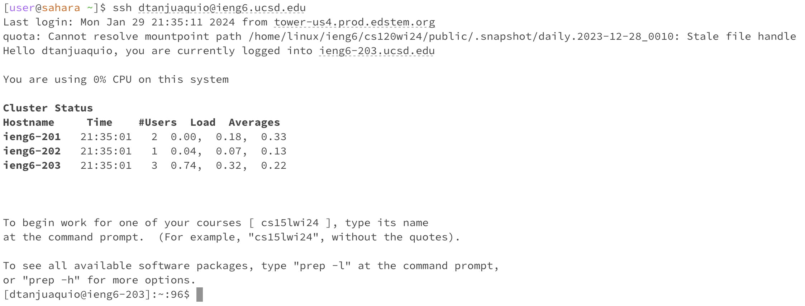

**Lab Report 2 - Servers and SSH Keys**

---

***Part 1***

**ChatServer code**
```
import java.io.IOException;
import java.net.URI;
class Handler implements URLHandler {
    // The one bit of state on the server: a number that will be manipulated by
    // various requests.
    String str = "";
    public String handleRequest(URI url) {
        if (url.getPath().equals("/")) {
            return String.format(str);
        } else {
            if (url.getPath().contains("/add-message")) {
                String[] parameters = url.getQuery().split("=");
                if (parameters[0].equals("s")) {
                    String tempString = parameters[2] + ": " + parameters[1].substring(0, parameters[1].indexOf("&"));
                    str += "\n" + tempString;
                    return String.format(str);
                }
            }
            return "404 Not Found!";
        }
    }
}

class ChatServer {
    public static void main(String[] args) throws IOException {
        if(args.length == 0){
            System.out.println("Missing port number! Try any number between 1024 to 49151");
            return;
        }

        int port = Integer.parseInt(args[0]);

        Server.start(port, new Handler());
    }
}
```
---
**Using `add-message`**



Methods: The `public static void main(String[] args) throws IOException` and `public String handleRequest(URI url)` methods are called.

Relevant Arguments: `s`, `TestMessage`, and `TestUser`

Relevant Values: 

`String str` is `" "`

`URI url` is `"https://0-0-0-0-12345-i3h456o6sbig5tcq5df0be0cus.us.edusercontent.com/add-message?s=TestMessage&user=TestUser"`

`String tempString` is `"TestUser: TestMessage"`

                 
Change in Values:

`String str` is changed to `"TestUser: TestMessage"` 




Methods: The `public static void main(String[] args) throws IOException` and `public String handleRequest(URI url)` methods are called.

Relevant Arguments: `s`, `Hello`, and `Destin`

Relevant Values: 

`String str` is `"Test User: Test Message"`

`URI url` is `"https://0-0-0-0-12345-i3h456o6sbig5tcq5df0be0cus.us.edusercontent.com/add-message?s=Hello&user=Destin"`

`String tempString` is `"Destin: Hello"`
                 
Change in Values: 

`String str` is changed to `"TestUser: TestMessage\n Destin: Hello"`

---

***Part 2***





---

***Part 3***

In labs 2 and 3, I learned about the interactions between servers and the specific code snippets that go into those interactions. I learned that how to affect a webserver's functionality directly through it's code. A particularly interesting aspect of this is that a host's output can be affected by changes to the url.


