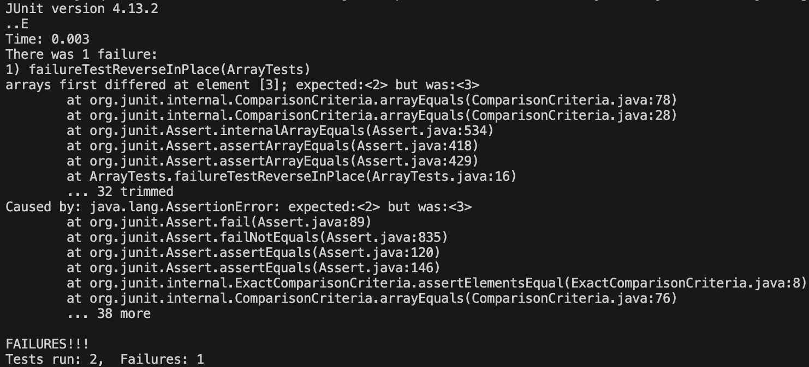

**Lab Report 3**
---
***Part 1***

**The Bug**
The `reverseInPlace` method does not return a reversed array. Instead, it mirrors the second half of the array backwards onto the first half. Thus, it creates a symmetrical array.

**Failure-Inducing Input**
```
@Test 
	public void failureTestReverseInPlace() {
    int[] input1 = {0, 1, 2, 3, 4, 5};
    ArrayExamples.reverseInPlace(input1);
    assertArrayEquals(new int[]{5, 4, 3, 2, 1, 0}, input1);
	}
```

**Non-Failure-Inducing Output**
```
@Test 
	public void noFailureTestReverseInPlace() {
    int[] input1 = {0, 1, 2, 3, 4, 5};
    ArrayExamples.reverseInPlace(input1);
    assertArrayEquals(new int[]{5, 4, 3, 3, 4, 5}, input1);
	}
```

**Symptom**


**Fix**

*Before*
```
// Changes the input array to be in reversed order
  static void reverseInPlace(int[] arr) {
    for(int i = 0; i < arr.length; i += 1) {
      arr[i] = arr[arr.length - i - 1];
    }
  }
```

*After*
```
// Changes the input array to be in reversed order
  static void reverseInPlace(int[] arr) {
    int tempArray[] = new int[arr.length];
    for(int i = 0; i < arr.length; i += 1) {
      tempArray[i] = arr[arr.length - i - 1];
    }
    for(int i = 0; i < arr.length; i++){
      arr[i] = tempArray[i];
    }
  }
```

**Explanation**
The original code would start at the beginning of the array, and change the beginning values (moving forward) to the last values (moving backward). This meant that when it was time for the last values to be changed to the beginning values, the beginning values had already been changed. 

I created a temporary new array with the length of the original array and to hold the reversed values so that the first changes would not interfere with the last. I then transferred all of the temporary reversed values to the original array.

***Part 2***

**`Less`**

**Source:** [Link](https://linux.die.net/man/1/less)

>`-E` Option

*Example 1*

Input: `destintanjuaquio@Destins-MacBook-Air plos % less -E journal.pbio.0020010.txt`

Output:
```

  
    
      
        
        JSTOR is successful for reasons its founders did not intend. Bill Bowen's inspired
        vision was of a solution to libraries' ever-voracious demands for space to house paper
        volumes. The idea was that libraries could save space by removing volumes available in
        electronic format. Few libraries have discarded the volumes digitised in JSTOR, but many
        libraries without the paper volumes have been able to offer their users access to the
        important journal runs JSTOR has digitised. Paper holdings have not decreased dramatically,
        but electronic holdings have increased. So a space-saving service became an access
        service.
        As an access service, JSTOR is a creation of its time. Understandable though the
        decision to use page images may have been eight years ago, future user-friendly access
        requires searching capabilities across full-text, which page images cannot supply.
        Likewise, the decision to digitise the back-runs of around 100—now 218—paper journals was a
        bold decision at the time, but the future for access to journal literature lies in
        electronic versions of thousands rather than hundreds of titles, both current and
        retrospective. When we reach that point, JSTOR will still have a valued place in the
        content on offer, but it is difficult to see JSTOR providing thousands rather than a few
        hundred titles. Its technical solutions and financial models look dated as both
        subscription-based and open-access publishers improve their services to authors and to
        readers. As the number of journal articles accessible over the networks increases, JSTOR
        will be seen as a small-scale pioneer from which we learned valuable lessons.
        Roger Schonfeld ends his very detailed description of JSTOR with a chapter on ‘Lessons
        Learned’, many of which are relevant to current access initiatives. The need for grant
        funding to launch any such initiative has to be accompanied by a sound business plan to
        ensure long-term economic viability. JSTOR has achieved that transition, and its success
        provides a model for others. Much of the credit must go to JSTOR's enterprising president,
        Kevin Guthrie, who found the quickest way through the maze of conflicting advice—much of
        which could have resulted in JSTOR's reaching a deadend—and convinced the library and
        publishing communities to buy into a product that was only a promise. Meeting user needs
        for easy access to high-quality content was the key to the fulfilment of that promise.
        JSTOR's public image is of quality in depth—long runs of core journals—and that image has
        to become the hallmark of the new open-access initiatives as they develop.
        It is understandable that some mistakes were made on the way. The difficulty that JSTOR
        financial planning had in coming to terms with consortial purchases delayed its growth as
        an access service. Although selling to consortia of academic libraries may not have
        improved JSTOR's financial position in the short-term, consortia are a route to spreading
        access and therefore securing longer-term financial stability (as the major publishers have
        realised through their ‘Big Deals’ in selling hundreds of journals to hundreds of libraries
        in a consortium). Some opportunities were also delayed—not lost—through too slow an
        adaptation of the JSTOR purchasing model for selling outside the United States, the United
        Kingdom being the exception. The UK deal was with JISC, the Joint Information Systems
        Committee of the UK Higher Education Funding Councils, acting more as a negotiating agent
        than a consortium, and this model could have been applied in other countries. More
        countries would have valued access to JSTOR earlier, but the approach to non-US deals had
        to be imaginative. For all vendors, there has to be an understanding of the political,
        social, economic, and educational structure of the country into which the product is being
        sold, an understanding that takes time to acquire but that pays dividends. Open-access
        publishers do not have to sell their product to users of their journals, but local
        knowledge is essential in ‘selling’ their services to authors. The globalisation of
        publishing has combined with the globalisation of the networks and with the globalisation
        of research to provide opportunities for high-quality research conducted outside North
        America and Western Europe to be published in peer-reviewed open-access journals more
        readily than in the traditional subscription-based journals.
        Roger Schonfeld's book draws out many of the significant points about JSTOR's place in
        the history of electronic publication through a minute examination of the process leading
        to JSTOR as it is today. There is so much detail in the book that the reader may feel that
        its comprehensiveness cannot be questioned, but one small omission of which I have personal
        knowledge makes me question the value of so much detail. The omission concerns the interest
        by my institution, University College London, in joining JSTOR before the JISC deal was
        considered. Not a detail of world-shattering significance, but it does illustrate the fact
        that outside the United States, as well as within, the early interest in JSTOR came from
        individual institutions rather than from consortia. I sympathise with Roger Schonfeld in
        attempting to write such a comprehensive history, but what is the point of appearing to be
        comprehensive when comprehensiveness is an impossible goal? Would a briefer history have
        been just as valuable?
        Leaving aside quibbles and caveats about the book and about JSTOR, this remains a
        fascinating and instructive history of an important and ground-breaking initiative. Bill
        Bowen's vision may not have developed in quite the way he expected, but the ‘bottom-line’
        is that the vision did become a successful reality. The problem of ever-expanding libraries
        has not gone away in the ten years since JSTOR was conceived, but the ultimate solution—the
        availability of electronic content—has become closer, and JSTOR's success has encouraged
        others to develop services that are more in accord with 2003 than 1993. One lesson Roger
        Schonfeld does not draw out is the pace of change in electronic publishing, and if so much
        has been achieved since 1993, what promise is held out by the next ten years'!
      
      
        
      
    
  
:
```
Explanation: While the actual output of the `less` command is not altered by the `-E` option, the `less` is exited once the user scrolls to the bottom of the file. This is useful in the event that the user only wants to take only a single look-through of the specified file. 

---

*Example 2*

Input: `destintanjuaquio@Destins-MacBook-Air plos % less -E journal.pbio.0020040.txt`

Output:
```

  
    
      
        
        For people who received their introduction to cancer genetics in college in the first
        half of the 1990s, everything looked simple and straightforward. It was the stuff you could
        explain to sincerely interested relatives who wanted to know what you were spending your
        time on. There were oncogenes and there were tumour suppressor genes. Oncogenes were
        overactive genes and proteins that somehow caused cancer because they were overactive;
        therefore, they were dominant. Tumour suppressor genes were genes that would normally
        prevent a tumour from happening and that needed to be inactivated for a tumour to start to
        form; both copies of a tumour suppressor gene had to be inactivated, and the mutation was
        recessive. If inactivation of these genes is a random process, it was understandable that
        people who inherit an inactivated copy of a tumour suppressor gene had a higher risk of
        developing the associated form(s) of cancer than people born with two normal copies, as
        postulated in Alfred Knudson's (1971) two-hit model. And, indeed, it was shown that in the
        tumours in these predisposed patients, the remaining wild-type copy of the tumour
        suppressor gene was lost, a process referred to as loss of heterozygosity.
        For me, in 1998 things started to change. Venkatachalam et al. (1998) published a paper
        in the 
        EMBO Journal describing a detailed study of tumours in mice lacking one
        copy of the p53 tumour suppressor gene (
        Trp53 ). This gene is known to be the most mutated gene in human cancer
        and its function to be central to many processes that are involved in the cellular
        prevention of cancer. Mice lacking both copies of this gene are for the most part viable,
        but succumb to cancer (mainly thymic lymphomas) at three to five months of age (Donehower
        et al. 1992). Mice born with one copy of the 
        Trp53 gene start to develop cancer at around nine months, and incidence
        increases with age.
        In their study, Venkatachalam and colleagues analysed an impressive group of 217 
        Trp53
        +/− mice of controlled genetic background and followed the fate of the 
        Trp53 wild-type allele in the tumours. According to the two-hit model, it
        was expected that in these tumours this copy would have been lost or inactivated. However,
        this turned out not to be the case. Half of the tumours from mice younger than 18 months
        were found to have retained the wild-type copy of 
        Trp53 , a number that increased to 85% in mice older than 18 months. In
        two tumours, the researchers sequenced the complete coding region of the remaining
        wild-type allele and showed it was structurally intact. To exclude the possibility of
        downregulation or inactivation at the level of protein expression, they irradiated
        tumour-bearing mice prior to sacrifice, a treatment known to increase p53 protein levels
        via posttranslational mechanisms. Their data showed the retained wild-type allele in these
        tumours was expressed normally and suggested it had a normal wild-type conformation.
        Next, the authors did a rigorous test of different functions of the p53 protein. They
        first tested whether the tumours showed amplification of Mdm2. This protein, whose
        expression is regulated by p53, stimulates breakdown of p53, thereby forming a negative
        feedback mechanism that keeps p53 levels low. Some tumours therefore amplify the 
        Mdm2 gene as a means of inactivating p53. However, this was not found in
        the tumours from the 
        Trp53
        +/− mice. Subsequently, the researchers tested to what extent the
        retained 
        Trp53 copy behaved normally. Irradiation of many tissues leads to
        p53-dependent apoptosis, and, indeed, in tumours that had retained the wild-type allele,
        irradiation did lead to an increase in apoptosis, whereas in tumours that had lost the
        wild-type allele, it did not.
        The p53 protein is known to function as a transcriptional regulator by either up- or
        down regulating target genes in response to different forms of cellular stress, including
        irradiation-induced DNA damage. The authors studied the expression of two p53-upregulated
        genes (
        Cdkn1a , which encodes p21, and 
        Mdm2 ) and one downregulated gene (
        Pcna ) in p53-positive tumours after irradiation and showed responses
        indicative of normal p53 function. Furthermore, it was shown that the p53 protein from the
        tumours was able to bind to a p53-binding DNA sequence in an in vitro setting. Finally,
        since it is known that p53 absence in tumours is correlated with chromosomal instability,
        Venkatachalam et al. (1998) used comparative genome hybridisation to compare this feature
        between p53-negative and p53-positive tumours and found a 5-fold greater stability in the
        latter.
        In short, this paper clearly showed that, at least in mice, in many 
        Trp53
        +/− tumours the wild-type allele of 
        Trp53 is not only retained, but also appears to function normally. This
        strongly suggested that a decrease of dosage in p53 is already sufficient for
        tumourigenesis, a phenomenon referred to as haploinsufficiency. Shortly before, the group
        of Moshe Oren (Gottlieb et al. 1997) had shown that a 
        Trp53
        +/− background leads to a greater than 50% reduction in p53 activity
        using a p53-responsive 
        lacZ reporter gene in transgenic mice. Venkatachalam and colleagues
        suggested the strong concentration dependence of p53 function could be explained by the
        fact that p53 functions as a tetramer. A 50% decrease in p53 monomers can easily be
        imagined to result in a greater than 50% decrease in functional tetramers, which in turn
        increases the chances of these cells becoming cancerous.
        This paper by Venkatachalam et al. (1998) made me realise how important it is to remain
        critical, even of long-established theories and models. Since then, haploinsufficient
        mechanisms have been described in more tumour suppressor genes in humans and mice (reviewed
        in Fodde and Smits 2002). For instance, in a recent paper in 
        PLoS Biology , Trotman et al. (2003) used mouse models to describe how
        the dosage of the 
        Pten tumour suppressor gene influences the occurrence of prostate cancer.
        Further genes have been described with other unexpected roles in the tumourigenic process.
        There is a long-standing debate in the literature about the number and role of mutations in
        a tumour, and without going into the details, it is clear that haploinsufficient mechanisms
        for tumour suppressor genes will greatly influence the statistics on which these
        discussions are based. At a time when microarray analysis has become a standard experiment
        and the many thousands of changes in tumour cells are analysed across the whole genome, it
        is important to keep in mind that the correct interpretation of this wealth of information
        might be more complicated than the widely accepted models would have us believe.
      
      
        
      
    

:
```
Explanation: While the actual output of the `less` command is not altered by the `-E` option, the `less` is exited once the user scrolls to the bottom of the file. This is useful in the event that the user only wants to take only a single look-through of the specified file.

---

>`-F` Option

*Example 1*

Input: `destintanjuaquio@Destins-MacBook-Air plos % less -F pmed.0020281.txt`

Output:
```

  
    
      
        
        Whistleblowers serve no function if they cannot tell their stories. The present story of
        whistleblowing—as discussed, in part, in 
        PLoS Medicine —that involves the pharmaceutical industry, pharmaceutical
        benefit management corporations, the managed care industry, and the political and lobbying
        forces that zealously guard their secrets could not have been told without the help of
        courageous men and women [1, 2] For that reason, those of us who congregated in Washington,
        D.C., on May 15th, 2005, at the invitation and support of the Public Library of Science and
        the Government Accountability Project feel particularly humbled and grateful to these two
        sponsors. Our convictions could not have been aired were it not for the essential First
        Amendment work of responsible journalists, who exemplify the best in investigatory
        research.
        For me, whistleblowing is not a theoretical exercise. It has a human face and tangible
        features. It is the face of children and adults who have been injured or killed by
        misrepresented pharmaceuticals; clinical research trial results that have been sequestered
        from the scientific community and whose incomplete findings cause injury; and
        pharmaceuticals that are detailed to physicians, not to save lives or necessarily improve
        the health or welfare of the recipients, but to make money.
        In the lonely and, at times, discouraging world of whistleblowing, we whistleblowers are
        passionate, and often successful, because our efforts have a different goal than the
        corporations and political interests whose operations we occasionally challenge. Our goal
        is to tell the truth. That honest effort is the source of any ethical difference we can or
        might make. Truth is the basis for the power of a whistleblower, one that can withstand the
        assault of unprecedented odds against being heard put forth by that sum of political power,
        expediency, and money.
        A whistleblower's success depends upon competent and articulate media. The debate to
        improve the status quo—be it in pharmaceutical marketing or managed-care decision
        making—cannot proceed or flourish without it.
        Ralph Waldo Emerson, American essayist and philosopher (1803–1882), commented about
        success (I have adapted his comments for all of us who gathered in Washington in mid-May
        2005): “To leave the world a bit better, whether by a healthy child, a garden patch or a
        redeemed social condition; to know even one life breathed easier because you have lived;
        this is to have succeeded [as a whistleblower].”
      
    

```
Explanation: The `-F` option of `less` automatically exits `less` if the specified text file can fit within one terminal screen. With this specific example, the specified file is indeed short enough. The command prints out the entire text file and it can be seen in the terminal while outside of `less`.

---

*Example 2*

Input: `destintanjuaquio@Destins-MacBook-Air plos % less -F journal.pbio.0020010.txt`

Output:
```

  
    
      
        
        JSTOR is successful for reasons its founders did not intend. Bill Bowen's inspired
        vision was of a solution to libraries' ever-voracious demands for space to house paper
        volumes. The idea was that libraries could save space by removing volumes available in
        electronic format. Few libraries have discarded the volumes digitised in JSTOR, but many
        libraries without the paper volumes have been able to offer their users access to the
        important journal runs JSTOR has digitised. Paper holdings have not decreased dramatically,
        but electronic holdings have increased. So a space-saving service became an access
        service.
        As an access service, JSTOR is a creation of its time. Understandable though the
        decision to use page images may have been eight years ago, future user-friendly access
        requires searching capabilities across full-text, which page images cannot supply.
        Likewise, the decision to digitise the back-runs of around 100—now 218—paper journals was a
        bold decision at the time, but the future for access to journal literature lies in
        electronic versions of thousands rather than hundreds of titles, both current and
        retrospective. When we reach that point, JSTOR will still have a valued place in the
        content on offer, but it is difficult to see JSTOR providing thousands rather than a few
        hundred titles. Its technical solutions and financial models look dated as both
        subscription-based and open-access publishers improve their services to authors and to
        readers. As the number of journal articles accessible over the networks increases, JSTOR
        will be seen as a small-scale pioneer from which we learned valuable lessons.
        Roger Schonfeld ends his very detailed description of JSTOR with a chapter on ‘Lessons
        Learned’, many of which are relevant to current access initiatives. The need for grant
        funding to launch any such initiative has to be accompanied by a sound business plan to
        ensure long-term economic viability. JSTOR has achieved that transition, and its success
        provides a model for others. Much of the credit must go to JSTOR's enterprising president,
        Kevin Guthrie, who found the quickest way through the maze of conflicting advice—much of
        which could have resulted in JSTOR's reaching a deadend—and convinced the library and
        publishing communities to buy into a product that was only a promise. Meeting user needs
        for easy access to high-quality content was the key to the fulfilment of that promise.
        JSTOR's public image is of quality in depth—long runs of core journals—and that image has
        to become the hallmark of the new open-access initiatives as they develop.
        It is understandable that some mistakes were made on the way. The difficulty that JSTOR
        financial planning had in coming to terms with consortial purchases delayed its growth as
        an access service. Although selling to consortia of academic libraries may not have
        improved JSTOR's financial position in the short-term, consortia are a route to spreading
        access and therefore securing longer-term financial stability (as the major publishers have
        realised through their ‘Big Deals’ in selling hundreds of journals to hundreds of libraries
        in a consortium). Some opportunities were also delayed—not lost—through too slow an
        adaptation of the JSTOR purchasing model for selling outside the United States, the United
        Kingdom being the exception. The UK deal was with JISC, the Joint Information Systems
        Committee of the UK Higher Education Funding Councils, acting more as a negotiating agent
        than a consortium, and this model could have been applied in other countries. More
        countries would have valued access to JSTOR earlier, but the approach to non-US deals had
        to be imaginative. For all vendors, there has to be an understanding of the political,
        social, economic, and educational structure of the country into which the product is being
        sold, an understanding that takes time to acquire but that pays dividends. Open-access
        publishers do not have to sell their product to users of their journals, but local
        knowledge is essential in ‘selling’ their services to authors. The globalisation of
        publishing has combined with the globalisation of the networks and with the globalisation
        of research to provide opportunities for high-quality research conducted outside North
        America and Western Europe to be published in peer-reviewed open-access journals more
        readily than in the traditional subscription-based journals.
        Roger Schonfeld's book draws out many of the significant points about JSTOR's place in
        the history of electronic publication through a minute examination of the process leading
        to JSTOR as it is today. There is so much detail in the book that the reader may feel that
        its comprehensiveness cannot be questioned, but one small omission of which I have personal
        knowledge makes me question the value of so much detail. The omission concerns the interest
        by my institution, University College London, in joining JSTOR before the JISC deal was
        considered. Not a detail of world-shattering significance, but it does illustrate the fact
        that outside the United States, as well as within, the early interest in JSTOR came from
        individual institutions rather than from consortia. I sympathise with Roger Schonfeld in
        attempting to write such a comprehensive history, but what is the point of appearing to be
        comprehensive when comprehensiveness is an impossible goal? Would a briefer history have
        been just as valuable?
        Leaving aside quibbles and caveats about the book and about JSTOR, this remains a
        fascinating and instructive history of an important and ground-breaking initiative. Bill
        Bowen's vision may not have developed in quite the way he expected, but the ‘bottom-line’
        is that the vision did become a successful reality. The problem of ever-expanding libraries
        has not gone away in the ten years since JSTOR was conceived, but the ultimate solution—the
        availability of electronic content—has become closer, and JSTOR's success has encouraged
        others to develop services that are more in accord with 2003 than 1993. One lesson Roger
        Schonfeld does not draw out is the pace of change in electronic publishing, and if so much
        has been achieved since 1993, what promise is held out by the next ten years'!
      
      
        
      
    
  
:
```
Explanation: The `-F` option of `less` automatically exits `less` if the specified text file can fit within one terminal screen. With this specific example, the specified file is not short enough to fit within one terminal screen. The command displays the text file in `less` as normal and it needs to be exited in order to continue giving separate commands.

---

>`-M` Option

*Example 1*

Input: `destintanjuaquio@Destins-MacBook-Air plos % less -M journal.pbio.0020010.txt`
Output:
```


  
    
      
        
        JSTOR is successful for reasons its founders did not intend. Bill Bowen's inspired
        vision was of a solution to libraries' ever-voracious demands for space to house paper
        volumes. The idea was that libraries could save space by removing volumes available in
        electronic format. Few libraries have discarded the volumes digitised in JSTOR, but many
        libraries without the paper volumes have been able to offer their users access to the
        important journal runs JSTOR has digitised. Paper holdings have not decreased dramatically,
        but electronic holdings have increased. So a space-saving service became an access
        service.
        As an access service, JSTOR is a creation of its time. Understandable though the
        decision to use page images may have been eight years ago, future user-friendly access
        requires searching capabilities across full-text, which page images cannot supply.
        Likewise, the decision to digitise the back-runs of around 100—now 218—paper journals was a
        bold decision at the time, but the future for access to journal literature lies in
        electronic versions of thousands rather than hundreds of titles, both current and
        retrospective. When we reach that point, JSTOR will still have a valued place in the
        content on offer, but it is difficult to see JSTOR providing thousands rather than a few
        hundred titles. Its technical solutions and financial models look dated as both
        subscription-based and open-access publishers improve their services to authors and to
        readers. As the number of journal articles accessible over the networks increases, JSTOR
        will be seen as a small-scale pioneer from which we learned valuable lessons.
        Roger Schonfeld ends his very detailed description of JSTOR with a chapter on ‘Lessons
        Learned’, many of which are relevant to current access initiatives. The need for grant
        funding to launch any such initiative has to be accompanied by a sound business plan to
        ensure long-term economic viability. JSTOR has achieved that transition, and its success
        provides a model for others. Much of the credit must go to JSTOR's enterprising president,
        Kevin Guthrie, who found the quickest way through the maze of conflicting advice—much of
        which could have resulted in JSTOR's reaching a deadend—and convinced the library and
        publishing communities to buy into a product that was only a promise. Meeting user needs
        for easy access to high-quality content was the key to the fulfilment of that promise.
        JSTOR's public image is of quality in depth—long runs of core journals—and that image has
        to become the hallmark of the new open-access initiatives as they develop.
        It is understandable that some mistakes were made on the way. The difficulty that JSTOR
        financial planning had in coming to terms with consortial purchases delayed its growth as
        an access service. Although selling to consortia of academic libraries may not have
        improved JSTOR's financial position in the short-term, consortia are a route to spreading
        access and therefore securing longer-term financial stability (as the major publishers have
        realised through their ‘Big Deals’ in selling hundreds of journals to hundreds of libraries
        in a consortium). Some opportunities were also delayed—not lost—through too slow an
        adaptation of the JSTOR purchasing model for selling outside the United States, the United
        Kingdom being the exception. The UK deal was with JISC, the Joint Information Systems
        Committee of the UK Higher Education Funding Councils, acting more as a negotiating agent
        than a consortium, and this model could have been applied in other countries. More
        countries would have valued access to JSTOR earlier, but the approach to non-US deals had
        to be imaginative. For all vendors, there has to be an understanding of the political,
        social, economic, and educational structure of the country into which the product is being
        sold, an understanding that takes time to acquire but that pays dividends. Open-access
        publishers do not have to sell their product to users of their journals, but local
        knowledge is essential in ‘selling’ their services to authors. The globalisation of
        publishing has combined with the globalisation of the networks and with the globalisation
        of research to provide opportunities for high-quality research conducted outside North
        America and Western Europe to be published in peer-reviewed open-access journals more
        readily than in the traditional subscription-based journals.
        Roger Schonfeld's book draws out many of the significant points about JSTOR's place in
        the history of electronic publication through a minute examination of the process leading
        to JSTOR as it is today. There is so much detail in the book that the reader may feel that
        its comprehensiveness cannot be questioned, but one small omission of which I have personal
        knowledge makes me question the value of so much detail. The omission concerns the interest
        by my institution, University College London, in joining JSTOR before the JISC deal was
        considered. Not a detail of world-shattering significance, but it does illustrate the fact
        that outside the United States, as well as within, the early interest in JSTOR came from
        individual institutions rather than from consortia. I sympathise with Roger Schonfeld in
        attempting to write such a comprehensive history, but what is the point of appearing to be
        comprehensive when comprehensiveness is an impossible goal? Would a briefer history have
        been just as valuable?
        Leaving aside quibbles and caveats about the book and about JSTOR, this remains a
        fascinating and instructive history of an important and ground-breaking initiative. Bill
        Bowen's vision may not have developed in quite the way he expected, but the ‘bottom-line’
        is that the vision did become a successful reality. The problem of ever-expanding libraries
        has not gone away in the ten years since JSTOR was conceived, but the ultimate solution—the
        availability of electronic content—has become closer, and JSTOR's success has encouraged
        others to develop services that are more in accord with 2003 than 1993. One lesson Roger
        Schonfeld does not draw out is the pace of change in electronic publishing, and if so much
        has been achieved since 1993, what promise is held out by the next ten years'!
      
      
        
      
    
  
journal.pbio.0020010.txt lines 16-83/84 100%
```
Explanation: While the actual output of the `less` command is not altered by the `-E` option, the prompt is made to be more verbose. That is, the prompt at the bottom displays the file name, what lines numbers are being displayed, and the percentage of the way down the page is. This is useful for users to know how much of the text file they have viewed in `less.`

---

*Example 2*

Input: `destintanjuaquio@Destins-MacBook-Air plos % less -M journal.pbio.0020040.txt`
Output:
```

  
    
      
        
        For people who received their introduction to cancer genetics in college in the first
        half of the 1990s, everything looked simple and straightforward. It was the stuff you could
        explain to sincerely interested relatives who wanted to know what you were spending your
        time on. There were oncogenes and there were tumour suppressor genes. Oncogenes were
        overactive genes and proteins that somehow caused cancer because they were overactive;
        therefore, they were dominant. Tumour suppressor genes were genes that would normally
        prevent a tumour from happening and that needed to be inactivated for a tumour to start to
        form; both copies of a tumour suppressor gene had to be inactivated, and the mutation was
        recessive. If inactivation of these genes is a random process, it was understandable that
        people who inherit an inactivated copy of a tumour suppressor gene had a higher risk of
        developing the associated form(s) of cancer than people born with two normal copies, as
        postulated in Alfred Knudson's (1971) two-hit model. And, indeed, it was shown that in the
        tumours in these predisposed patients, the remaining wild-type copy of the tumour
        suppressor gene was lost, a process referred to as loss of heterozygosity.
        For me, in 1998 things started to change. Venkatachalam et al. (1998) published a paper
        in the 
        EMBO Journal describing a detailed study of tumours in mice lacking one
        copy of the p53 tumour suppressor gene (
        Trp53 ). This gene is known to be the most mutated gene in human cancer
        and its function to be central to many processes that are involved in the cellular
        prevention of cancer. Mice lacking both copies of this gene are for the most part viable,
        but succumb to cancer (mainly thymic lymphomas) at three to five months of age (Donehower
        et al. 1992). Mice born with one copy of the 
        Trp53 gene start to develop cancer at around nine months, and incidence
        increases with age.
        In their study, Venkatachalam and colleagues analysed an impressive group of 217 
        Trp53
        +/− mice of controlled genetic background and followed the fate of the 
        Trp53 wild-type allele in the tumours. According to the two-hit model, it
        was expected that in these tumours this copy would have been lost or inactivated. However,
        this turned out not to be the case. Half of the tumours from mice younger than 18 months
        were found to have retained the wild-type copy of 
        Trp53 , a number that increased to 85% in mice older than 18 months. In
        two tumours, the researchers sequenced the complete coding region of the remaining
        wild-type allele and showed it was structurally intact. To exclude the possibility of
        downregulation or inactivation at the level of protein expression, they irradiated
        tumour-bearing mice prior to sacrifice, a treatment known to increase p53 protein levels
        via posttranslational mechanisms. Their data showed the retained wild-type allele in these
        tumours was expressed normally and suggested it had a normal wild-type conformation.
        Next, the authors did a rigorous test of different functions of the p53 protein. They
        first tested whether the tumours showed amplification of Mdm2. This protein, whose
        expression is regulated by p53, stimulates breakdown of p53, thereby forming a negative
        feedback mechanism that keeps p53 levels low. Some tumours therefore amplify the 
        Mdm2 gene as a means of inactivating p53. However, this was not found in
        the tumours from the 
        Trp53
        +/− mice. Subsequently, the researchers tested to what extent the
        retained 
        Trp53 copy behaved normally. Irradiation of many tissues leads to
        p53-dependent apoptosis, and, indeed, in tumours that had retained the wild-type allele,
        irradiation did lead to an increase in apoptosis, whereas in tumours that had lost the
        wild-type allele, it did not.
        The p53 protein is known to function as a transcriptional regulator by either up- or
        down regulating target genes in response to different forms of cellular stress, including
        irradiation-induced DNA damage. The authors studied the expression of two p53-upregulated
        genes (
        Cdkn1a , which encodes p21, and 
        Mdm2 ) and one downregulated gene (
        Pcna ) in p53-positive tumours after irradiation and showed responses
        indicative of normal p53 function. Furthermore, it was shown that the p53 protein from the
        tumours was able to bind to a p53-binding DNA sequence in an in vitro setting. Finally,
        since it is known that p53 absence in tumours is correlated with chromosomal instability,
        Venkatachalam et al. (1998) used comparative genome hybridisation to compare this feature
        between p53-negative and p53-positive tumours and found a 5-fold greater stability in the
        latter.
        In short, this paper clearly showed that, at least in mice, in many 
        Trp53
        +/− tumours the wild-type allele of 
        Trp53 is not only retained, but also appears to function normally. This
        strongly suggested that a decrease of dosage in p53 is already sufficient for
        tumourigenesis, a phenomenon referred to as haploinsufficiency. Shortly before, the group
        of Moshe Oren (Gottlieb et al. 1997) had shown that a 
        Trp53
        +/− background leads to a greater than 50% reduction in p53 activity
        using a p53-responsive 
        lacZ reporter gene in transgenic mice. Venkatachalam and colleagues
        suggested the strong concentration dependence of p53 function could be explained by the
        fact that p53 functions as a tetramer. A 50% decrease in p53 monomers can easily be
        imagined to result in a greater than 50% decrease in functional tetramers, which in turn
        increases the chances of these cells becoming cancerous.
        This paper by Venkatachalam et al. (1998) made me realise how important it is to remain
        critical, even of long-established theories and models. Since then, haploinsufficient
        mechanisms have been described in more tumour suppressor genes in humans and mice (reviewed
        in Fodde and Smits 2002). For instance, in a recent paper in 
        PLoS Biology , Trotman et al. (2003) used mouse models to describe how
        the dosage of the 
        Pten tumour suppressor gene influences the occurrence of prostate cancer.
        Further genes have been described with other unexpected roles in the tumourigenic process.
        There is a long-standing debate in the literature about the number and role of mutations in
        a tumour, and without going into the details, it is clear that haploinsufficient mechanisms
        for tumour suppressor genes will greatly influence the statistics on which these
        discussions are based. At a time when microarray analysis has become a standard experiment
        and the many thousands of changes in tumour cells are analysed across the whole genome, it
        is important to keep in mind that the correct interpretation of this wealth of information
        might be more complicated than the widely accepted models would have us believe.
      
      
        
      
    

journal.pbio.0020040.txt lines 38-105/106 100%
```
Explanation: While the actual output of the `less` command is not altered by the `-E` option, the prompt is made to be more verbose. That is, the prompt at the bottom displays the file name, what lines numbers are being displayed, and the percentage of the way down the page is. This is useful for users to know how much of the text file they have viewed in `less.`

---

>`-N` Option

*Example 1*

Input: `destintanjuaquio@Destins-MacBook-Air plos % less -N journal.pbio.0020010.txt`

Output:
```
      1 
      2   
      3     
      4       
      5         
      6         JSTOR is successful for reasons its founders did not intend. Bill Bowen's inspired
      7         vision was of a solution to libraries' ever-voracious demands for space to house paper
      8         volumes. The idea was that libraries could save space by removing volumes available in
      9         electronic format. Few libraries have discarded the volumes digitised in JSTOR, but many
     10         libraries without the paper volumes have been able to offer their users access to the
     11         important journal runs JSTOR has digitised. Paper holdings have not decreased dramatically,
     12         but electronic holdings have increased. So a space-saving service became an access
     13         service.
     14         As an access service, JSTOR is a creation of its time. Understandable though the
     15         decision to use page images may have been eight years ago, future user-friendly access
     16         requires searching capabilities across full-text, which page images cannot supply.
     17         Likewise, the decision to digitise the back-runs of around 100—now 218—paper journals was a
     18         bold decision at the time, but the future for access to journal literature lies in
     19         electronic versions of thousands rather than hundreds of titles, both current and
     20         retrospective. When we reach that point, JSTOR will still have a valued place in the
     21         content on offer, but it is difficult to see JSTOR providing thousands rather than a few
     22         hundred titles. Its technical solutions and financial models look dated as both
     23         subscription-based and open-access publishers improve their services to authors and to
     24         readers. As the number of journal articles accessible over the networks increases, JSTOR
     25         will be seen as a small-scale pioneer from which we learned valuable lessons.
     26         Roger Schonfeld ends his very detailed description of JSTOR with a chapter on ‘Lessons
     27         Learned’, many of which are relevant to current access initiatives. The need for grant
     28         funding to launch any such initiative has to be accompanied by a sound business plan to
     29         ensure long-term economic viability. JSTOR has achieved that transition, and its success
     30         provides a model for others. Much of the credit must go to JSTOR's enterprising president,
     31         Kevin Guthrie, who found the quickest way through the maze of conflicting advice—much of
     32         which could have resulted in JSTOR's reaching a deadend—and convinced the library and
     33         publishing communities to buy into a product that was only a promise. Meeting user needs
     34         for easy access to high-quality content was the key to the fulfilment of that promise.
     35         JSTOR's public image is of quality in depth—long runs of core journals—and that image has
     36         to become the hallmark of the new open-access initiatives as they develop.
     37         It is understandable that some mistakes were made on the way. The difficulty that JSTOR
     38         financial planning had in coming to terms with consortial purchases delayed its growth as
     39         an access service. Although selling to consortia of academic libraries may not have
     40         improved JSTOR's financial position in the short-term, consortia are a route to spreading
     41         access and therefore securing longer-term financial stability (as the major publishers have
     42         realised through their ‘Big Deals’ in selling hundreds of journals to hundreds of libraries
     43         in a consortium). Some opportunities were also delayed—not lost—through too slow an
     44         adaptation of the JSTOR purchasing model for selling outside the United States, the United
     45         Kingdom being the exception. The UK deal was with JISC, the Joint Information Systems
     46         Committee of the UK Higher Education Funding Councils, acting more as a negotiating agent
     47         than a consortium, and this model could have been applied in other countries. More
     48         countries would have valued access to JSTOR earlier, but the approach to non-US deals had
     49         to be imaginative. For all vendors, there has to be an understanding of the political,
     50         social, economic, and educational structure of the country into which the product is being
     51         sold, an understanding that takes time to acquire but that pays dividends. Open-access
     52         publishers do not have to sell their product to users of their journals, but local
     53         knowledge is essential in ‘selling’ their services to authors. The globalisation of
     54         publishing has combined with the globalisation of the networks and with the globalisation
     55         of research to provide opportunities for high-quality research conducted outside North
     56         America and Western Europe to be published in peer-reviewed open-access journals more
     57         readily than in the traditional subscription-based journals.
     58         Roger Schonfeld's book draws out many of the significant points about JSTOR's place in
     59         the history of electronic publication through a minute examination of the process leading
     60         to JSTOR as it is today. There is so much detail in the book that the reader may feel that
     61         its comprehensiveness cannot be questioned, but one small omission of which I have personal
     62         knowledge makes me question the value of so much detail. The omission concerns the interest
     63         by my institution, University College London, in joining JSTOR before the JISC deal was
     64         considered. Not a detail of world-shattering significance, but it does illustrate the fact
     65         that outside the United States, as well as within, the early interest in JSTOR came from
     66         individual institutions rather than from consortia. I sympathise with Roger Schonfeld in
     67         attempting to write such a comprehensive history, but what is the point of appearing to be
     68         comprehensive when comprehensiveness is an impossible goal? Would a briefer history have
     69         been just as valuable?
     70         Leaving aside quibbles and caveats about the book and about JSTOR, this remains a
     71         fascinating and instructive history of an important and ground-breaking initiative. Bill
     72         Bowen's vision may not have developed in quite the way he expected, but the ‘bottom-line’
     73         is that the vision did become a successful reality. The problem of ever-expanding libraries
     74         has not gone away in the ten years since JSTOR was conceived, but the ultimate solution—the
     75         availability of electronic content—has become closer, and JSTOR's success has encouraged
     76         others to develop services that are more in accord with 2003 than 1993. One lesson Roger
     77         Schonfeld does not draw out is the pace of change in electronic publishing, and if so much
     78         has been achieved since 1993, what promise is held out by the next ten years'!
     79       
     80       
     81         
     82       
     83     
     84
(END)
```

Explanation: The `-N` option displays the specified file as usual while displaying line numbers to the left of each line. This is useful for readers to locate specific line numbers of the text file, know how large paragraphs are, easily see blank lines, see how many total lines there, etc.

---

*Example 2*

Input: `destintanjuaquio@Destins-MacBook-Air plos % less -N journal.pbio.0020040.txt`

Output:
```
      1 
      2   
      3     
      4       
      5         
      6         For people who received their introduction to cancer genetics in college in the first
      7         half of the 1990s, everything looked simple and straightforward. It was the stuff you could
      8         explain to sincerely interested relatives who wanted to know what you were spending your
      9         time on. There were oncogenes and there were tumour suppressor genes. Oncogenes were
     10         overactive genes and proteins that somehow caused cancer because they were overactive;
     11         therefore, they were dominant. Tumour suppressor genes were genes that would normally
     12         prevent a tumour from happening and that needed to be inactivated for a tumour to start to
     13         form; both copies of a tumour suppressor gene had to be inactivated, and the mutation was
     14         recessive. If inactivation of these genes is a random process, it was understandable that
     15         people who inherit an inactivated copy of a tumour suppressor gene had a higher risk of
     16         developing the associated form(s) of cancer than people born with two normal copies, as
     17         postulated in Alfred Knudson's (1971) two-hit model. And, indeed, it was shown that in the
     18         tumours in these predisposed patients, the remaining wild-type copy of the tumour
     19         suppressor gene was lost, a process referred to as loss of heterozygosity.
     20         For me, in 1998 things started to change. Venkatachalam et al. (1998) published a paper
     21         in the 
     22         EMBO Journal describing a detailed study of tumours in mice lacking one
     23         copy of the p53 tumour suppressor gene (
     24         Trp53 ). This gene is known to be the most mutated gene in human cancer
     25         and its function to be central to many processes that are involved in the cellular
     26         prevention of cancer. Mice lacking both copies of this gene are for the most part viable,
     27         but succumb to cancer (mainly thymic lymphomas) at three to five months of age (Donehower
     28         et al. 1992). Mice born with one copy of the 
     29         Trp53 gene start to develop cancer at around nine months, and incidence
     30         increases with age.
     31         In their study, Venkatachalam and colleagues analysed an impressive group of 217 
     32         Trp53
     33         +/− mice of controlled genetic background and followed the fate of the 
     34         Trp53 wild-type allele in the tumours. According to the two-hit model, it
     35         was expected that in these tumours this copy would have been lost or inactivated. However,
     36         this turned out not to be the case. Half of the tumours from mice younger than 18 months
     37         were found to have retained the wild-type copy of 
     38         Trp53 , a number that increased to 85% in mice older than 18 months. In
     39         two tumours, the researchers sequenced the complete coding region of the remaining
     40         wild-type allele and showed it was structurally intact. To exclude the possibility of
     41         downregulation or inactivation at the level of protein expression, they irradiated
     42         tumour-bearing mice prior to sacrifice, a treatment known to increase p53 protein levels
     43         via posttranslational mechanisms. Their data showed the retained wild-type allele in these
     44         tumours was expressed normally and suggested it had a normal wild-type conformation.
     45         Next, the authors did a rigorous test of different functions of the p53 protein. They
     46         first tested whether the tumours showed amplification of Mdm2. This protein, whose
     47         expression is regulated by p53, stimulates breakdown of p53, thereby forming a negative
     48         feedback mechanism that keeps p53 levels low. Some tumours therefore amplify the 
     49         Mdm2 gene as a means of inactivating p53. However, this was not found in
     50         the tumours from the 
     51         Trp53
     52         +/− mice. Subsequently, the researchers tested to what extent the
     53         retained 
     54         Trp53 copy behaved normally. Irradiation of many tissues leads to
     55         p53-dependent apoptosis, and, indeed, in tumours that had retained the wild-type allele,
     56         irradiation did lead to an increase in apoptosis, whereas in tumours that had lost the
     57         wild-type allele, it did not.
     58         The p53 protein is known to function as a transcriptional regulator by either up- or
     59         down regulating target genes in response to different forms of cellular stress, including
     60         irradiation-induced DNA damage. The authors studied the expression of two p53-upregulated
     61         genes (
     62         Cdkn1a , which encodes p21, and 
     63         Mdm2 ) and one downregulated gene (
     64         Pcna ) in p53-positive tumours after irradiation and showed responses
     65         indicative of normal p53 function. Furthermore, it was shown that the p53 protein from the
     66         tumours was able to bind to a p53-binding DNA sequence in an in vitro setting. Finally,
     67         since it is known that p53 absence in tumours is correlated with chromosomal instability,
     68         Venkatachalam et al. (1998) used comparative genome hybridisation to compare this feature
     69         between p53-negative and p53-positive tumours and found a 5-fold greater stability in the
     70         latter.
     71         In short, this paper clearly showed that, at least in mice, in many 
     72         Trp53
     73         +/− tumours the wild-type allele of 
     74         Trp53 is not only retained, but also appears to function normally. This
     75         strongly suggested that a decrease of dosage in p53 is already sufficient for
     76         tumourigenesis, a phenomenon referred to as haploinsufficiency. Shortly before, the group
     77         of Moshe Oren (Gottlieb et al. 1997) had shown that a 
     78         Trp53
     79         +/− background leads to a greater than 50% reduction in p53 activity
     80         using a p53-responsive 
     81         lacZ reporter gene in transgenic mice. Venkatachalam and colleagues
     82         suggested the strong concentration dependence of p53 function could be explained by the
     83         fact that p53 functions as a tetramer. A 50% decrease in p53 monomers can easily be
     84         imagined to result in a greater than 50% decrease in functional tetramers, which in turn
     85         increases the chances of these cells becoming cancerous.
     86         This paper by Venkatachalam et al. (1998) made me realise how important it is to remain
     87         critical, even of long-established theories and models. Since then, haploinsufficient
     88         mechanisms have been described in more tumour suppressor genes in humans and mice (reviewed
     89         in Fodde and Smits 2002). For instance, in a recent paper in 
     90         PLoS Biology , Trotman et al. (2003) used mouse models to describe how
     91         the dosage of the 
     92         Pten tumour suppressor gene influences the occurrence of prostate cancer.
     93         Further genes have been described with other unexpected roles in the tumourigenic process.
     94         There is a long-standing debate in the literature about the number and role of mutations in
     95         a tumour, and without going into the details, it is clear that haploinsufficient mechanisms
     96         for tumour suppressor genes will greatly influence the statistics on which these
     97         discussions are based. At a time when microarray analysis has become a standard experiment
     98         and the many thousands of changes in tumour cells are analysed across the whole genome, it
     99         is important to keep in mind that the correct interpretation of this wealth of information
    100         might be more complicated than the widely accepted models would have us believe.
    101       
    102       
    103         
    104       
    105     
    106   
(END)
```
Explanation: The `-N` option displays the specified file as usual while displaying line numbers to the left of each line. This is useful for readers to locate specific line numbers of the text file, know how large paragraphs are, easily see blank lines, see how many total lines there, etc. 

---


