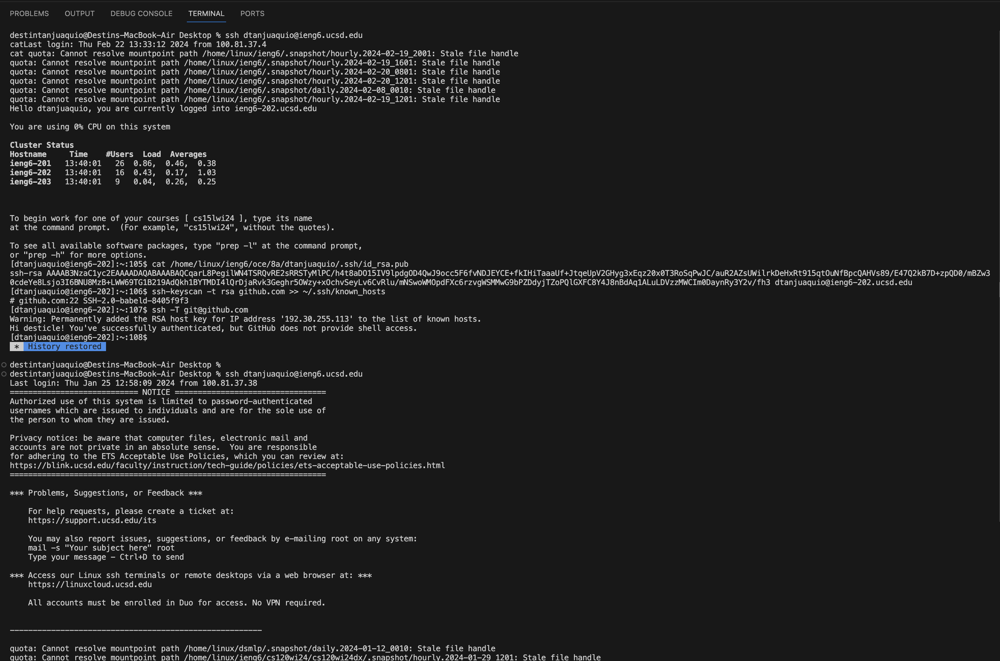
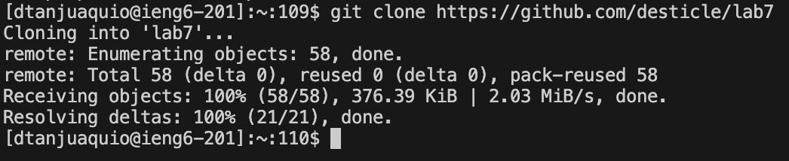
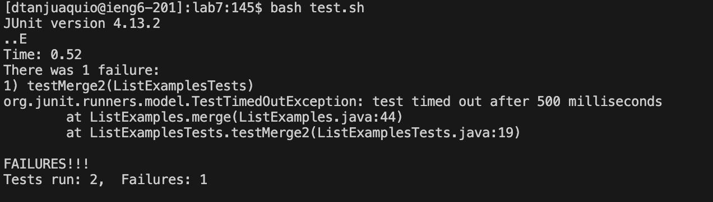
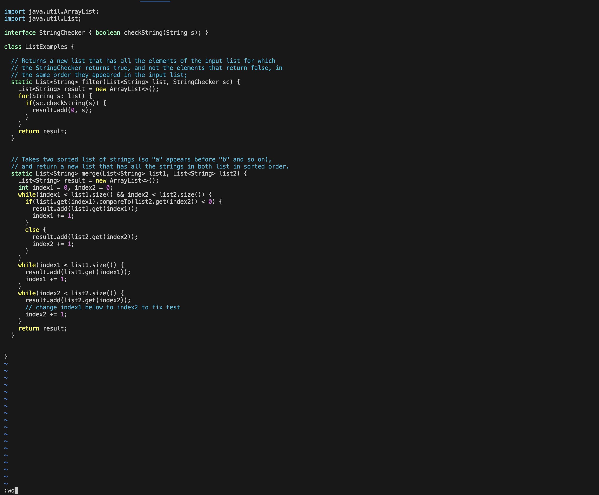
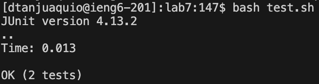

***Lab Report 4 - Vim***

**Step 4**

Keys Pressed: `ssh <space> dtanjuaquio@ieng.ucsd.edu <enter>`

Explanation: The keys I pressed were simply typing in the log-in and entering it.

**Step 5**

Keys Pressed: `git <space> clo <tab> <command>v <enter>`

Explanation: I typed the beginning of the git clone command and took a small shortcut by autofilling with `<tab>`. I then used `<command> v` to paste in the github link that I had copied, and I used `<enter>` to finalize the command.

**Step 6**

Keys Pressed: `cd <space> lab7 <enter>, bash t <tab> <enter>`

Explanation: I changed the current directory to be the cloned fork. I then typed in `bash test.sh` using `<tab>` to autofill when possible.

**Step 7**

Keys Pressed: `vim <space> L <tab> . <tab> <enter>, 44 <shift>g e r2 :wq <enter>`

Explanation: I typed `vim ListExamples.java`, using tab to autofill when possible. In the Vim, I used the first command to go to the 44th line, where the code to be changed was. I used `e` to move to the end of the word. I then used `r2` to replace `1` with `2`. To write and quit, I used `:wq`.

**Step 8**

Keys Pressed: `<up> <up> <enter>`

Explanation: The `bash test.sh` command was two up in the history. I used it again to run the tests.

**Step 9**

Keys Pressed:

