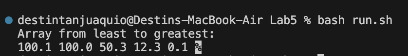
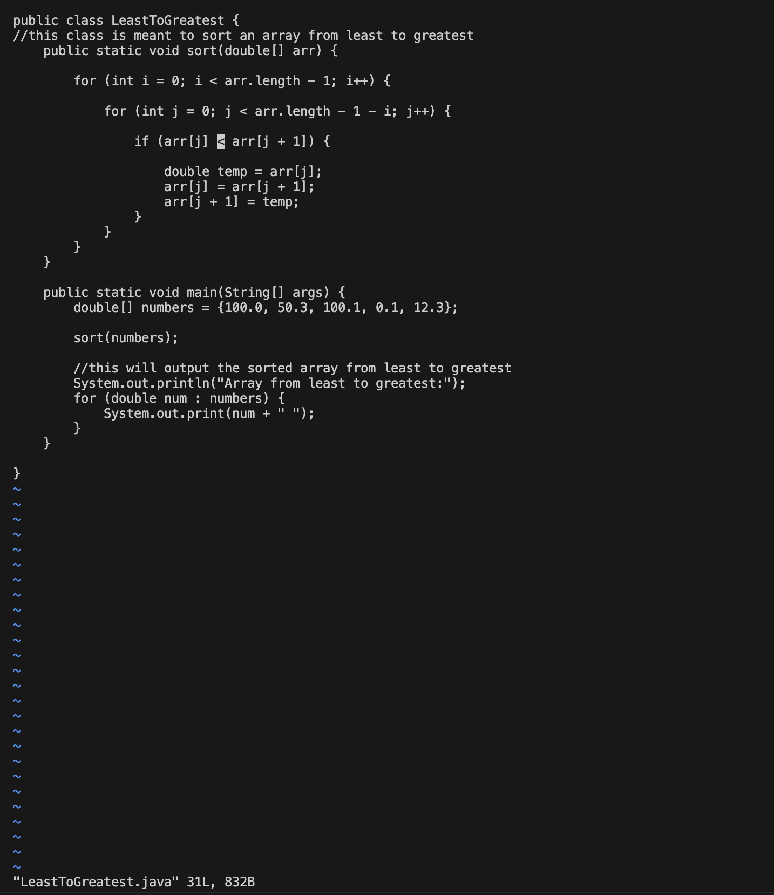

***Lab Report 5 - Putting it All Together***

**Part 1 - Debugging Scenario**

---

**Student Post**

> Student McStudent

"Hi, I wanted to ask for help about a weird error I've been getting with my program. I wrote code to sort a given array of numbers from least to greatest. The code compiles just fine, but something is wrong with the result. The array is sorted from greatest to least. There's a lot of logic crammed into the short amount of code I wrote, so I'm not super sure where the bug could be. I have a feeling one of my signs are flipped or one of my bounds in the for-loops are off by one."



---

---

**TA Post**

> Teacher McAssistant

"Hi, Student. If your code is compiling correctly, I'll assume the bounds for your for-loops are good. Try and `vim` into your code. Take a look at the core of your sorting logic and see if everything makes sense. Try switching around some of the comparative operators or flip some indexes. It seems like you have the right idea, just backward. If you find anything while in `vim`, use `r` to replace characters or `i` to insert (or delete) what you need. I hope this helps."

---

---

**Student Post**

> Student McStudent

"You were right. Everything about my code was good, I was thinking backwards when it came to comparing the values. In the `vim`, I saw that I had used a simple `<` instead of `>`. I used `r>` to replace it. Thanks."




---

**The file & directory structure needed:**

```
LeastToGreatest.java
run.sh
```

**The contents of each file before fixing the bug**

---

LeastToGreatest.java
```
public class LeastToGreatest {
//this class is meant to sort an array from least to greatest
    public static void sort(double[] arr) {

        for (int i = 0; i < arr.length - 1; i++) {

            for (int j = 0; j < arr.length - 1 - i; j++) {

                if (arr[j] < arr[j + 1]) {
            
                    double temp = arr[j];
                    arr[j] = arr[j + 1];
                    arr[j + 1] = temp;
                }
            }
        }
    }

    public static void main(String[] args) {
        double[] numbers = {100.0, 50.3, 100.1, 0.1, 12.3};

        sort(numbers);

        //this will output the sorted array from least to greatest
        System.out.println("Array from least to greatest:");
        for (double num : numbers) {
            System.out.print(num + " ");
        }
    }

}
```

---

run.sh
```
javac LeastToGreatest.java
if [ $? -eq 0 ]; then
    java LeastToGreatest.java
else
    echo "There was an error compiling the code."
fi
```

---

**The full command line (or lines) you ran to trigger the bug**

`bash run.sh`

**A description of what to edit to fix the bug**

The bug was in the following code block:
```
if (arr[j] < arr[j + 1]) {
            
                    double temp = arr[j];
                    arr[j] = arr[j + 1];
                    arr[j + 1] = temp;
                }
```
The bug was fixed by changing the `<` to a `>`. This was done using `vim` to edit the file.

---

**Part 2 - Reflection**
In the second half of this quarter, I learned a good amount obout the `vim` feature. I found it interesting that there was a way to be so interactive with the code from only working in a terminal. I think it's cool that there's so much navigation available in that aspect. I also enjoyed learning about bash scripts. I can definitely see the practicality of using them and how they might save time and effort. Overall, I'm beginning to see more and more pieces come together regarding how computer science flows. 


